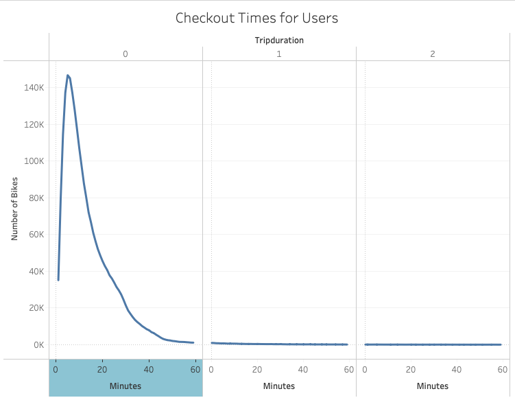
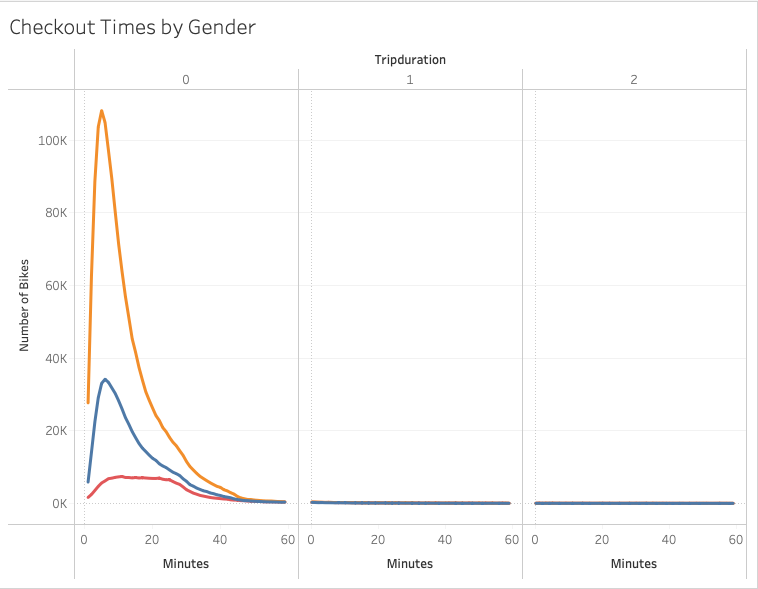
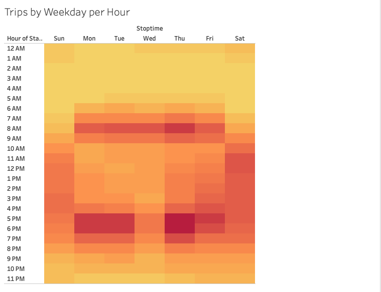
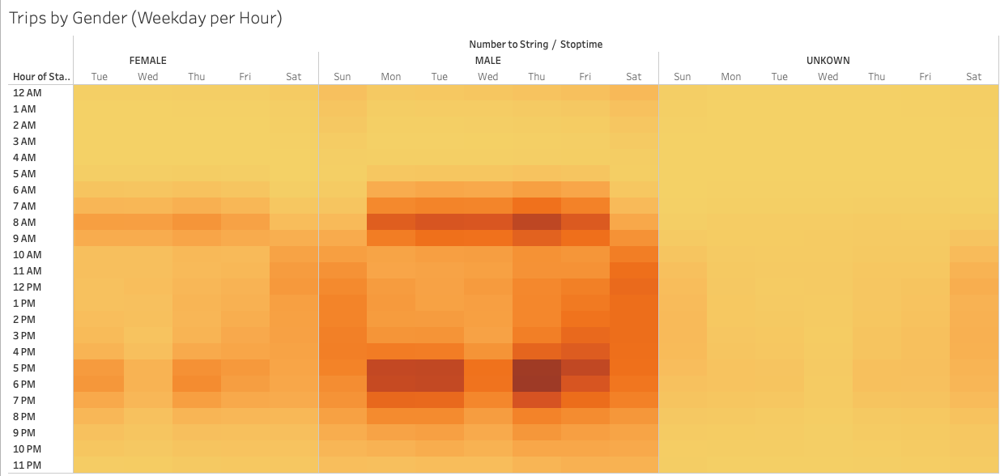
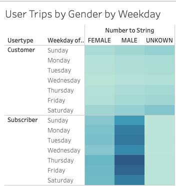

# Bikesharing Data
## Purpose
Using the data from a New York City bike sharing program to show potential investors that a bike-sharing program could work in Des Moines. One of the main focuses of this analysis will be on the bike trips themselves.

## Results

This line graph shows the duration for the number of riders. The biggest takeaway from this graph is that around the 20 minute mark is when the number of riders start to decrease. This number plummets to the bottom of the graph by the hour mark.

This line graph seperates the above data to show the users by gender. The data show that the biggest demographic would be males by a significantly larger margin than females and the unknown category.

Using a heat map it shows the trips by the hour throught the week. The dark part of the map shows a high usage around the time people would be going to work and coming home from work. Then there is increased use during the day on weekends.

This heat map uses the same data as above and seperates it by gender. From this map it shows that even though the females and unknown riders are less frequent riders they both have same patterns for usage.

Seperated by customers and subscribers this heat map shows usage throughout the weeek by gender. This data shows that a subscription based bike-sharing program brings in the most riders for male and female. 
